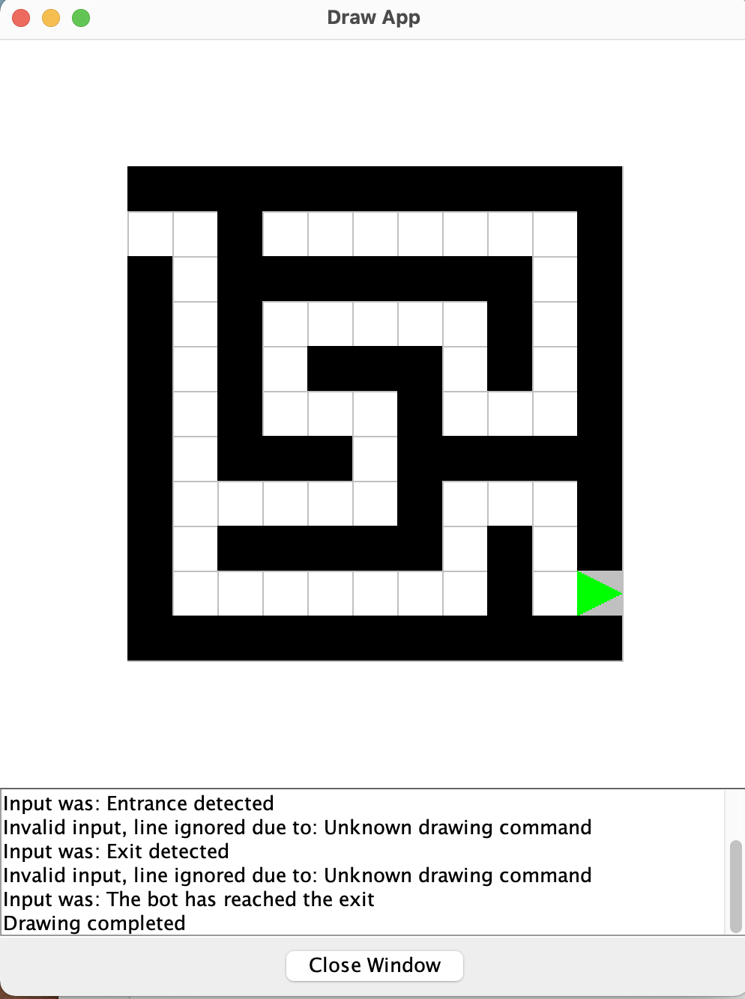

# mazeCourseWork
## Description
**This is a uni Computer Science course work**.
The whole project uses the [drawapp-2.0.jar](./drawapp-2.0.jar "drawapp-2.0.jar") to produce the animation and drawing.

The maze data are stored in the [maze.txt](./maze.txt "maze.txt")
## Requirement
Please make sure that ***[GCC](https://gcc.gnu.org "GCC")*** compiler and ***[JDK](https://www.oracle.com/java/technologies/downloads/ "JDK") 17 or later*** have been installed on your PC. 
Go check them out if you don't have them locally installed.

## Usage

To **run **the program: please run following commands below in the terminal.

`gcc *.c -o c_coursework`

`./c_coursework | java -jar drawapp-2.0.jar`

## What can this program do?
1. Display a maze in the drawing window, and the maze is stored in [maze.txt](./maze.txt "maze.txt") by using numbers.
2. Display a robot and animate it so that it moves through the maze to the exit marker.
3. A search algorithm is used for the robot to find the exit.
4. The program provides users pre-determined path and a search algorithm to make the robot reach the exit.

## Screenshot

